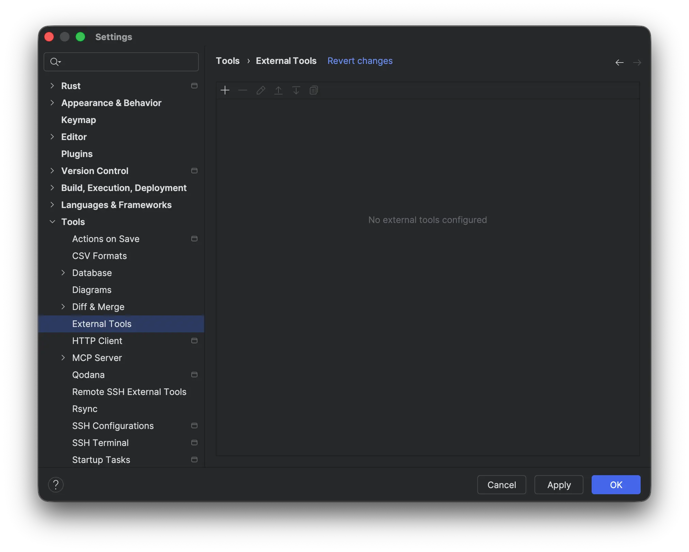
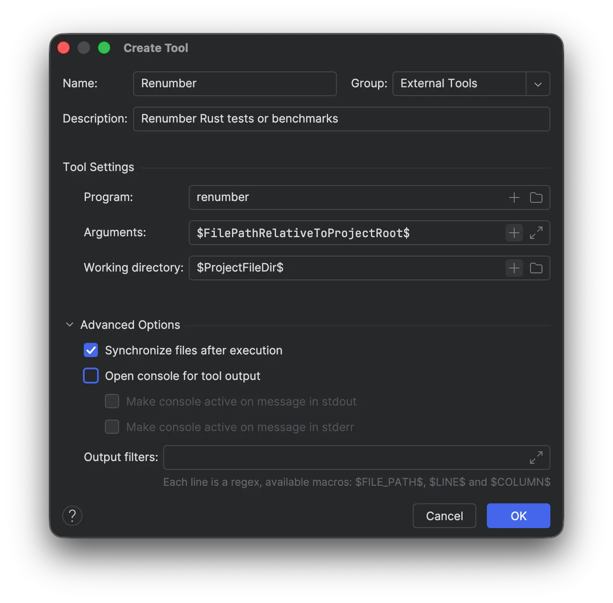
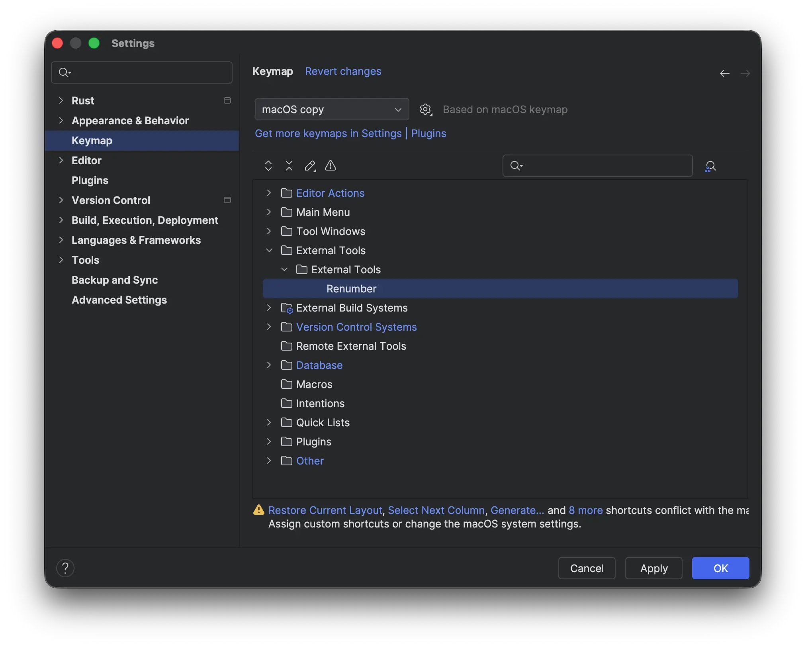
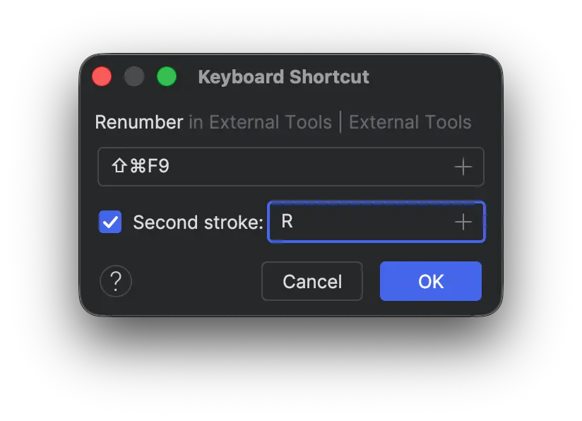

# Integration with JetBrains tools

## macOS

Open **Settings** ⇒ **Tools** ⇒ **External Tools** window:

 
Add a new configuration for [renumber] external tool:

Open keymap window on [renumber] external tool configuration:

Add new keyboard shortcut:

[renumber]: https://crates.io/crates/renumber
